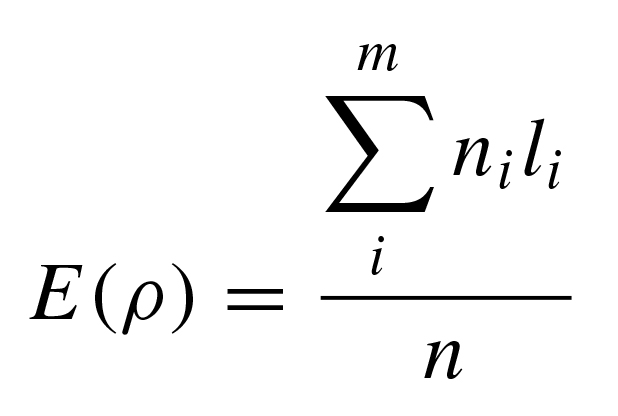
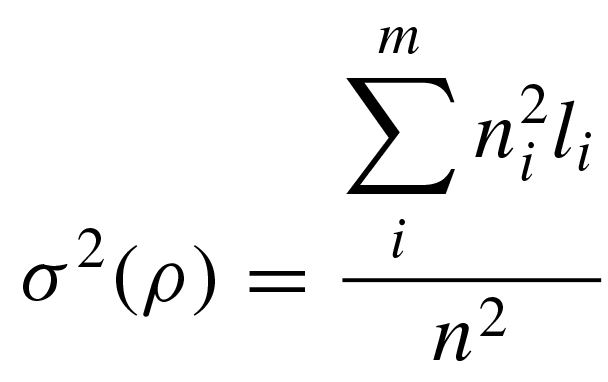

# msrho

This Perl program calculates the *ρ* ('rho') statistic for coalescent genealogies generated with the coalescent simulator [*ms*](http://home.uchicago.edu/%7Erhudson1/source/mksamples.html).

This code was reported in:

Cox MP. 2008. [Accuracy of molecular dating with the rho statistic: Deviations from coalescent expectations under a range of demographic models](https://www.jstor.org/stable/41466549). *Human Biology* 80: 335-357.

The *ρ* statistic was developed and described in:

Forster P, R Harding, A Torroni and H-J Bandelt. 1996. [Origin and evolution of Native American mtDNA variation: A reappraisal](https://www.ncbi.nlm.nih.gov/pmc/articles/PMC1914796/). *American Journal of Human Genetics* 59: 935-945.

The code implements equations 2 and 3 in Cox (2008) for the mean and variance of *ρ*:




where *l* is the average number of mutations on *m* unique lineages sampled from *n* individuals, with each lineage stemming from a defined ancestral node in a resolved gene tree.  

The program also calculates the number of segregating sites *S*, the standard deviation of *ρ*, and empirical upper and lower bounds of the 95% confidence interval of *ρ*.

> Note: *msrho* requires a defined ancestor node from which to calculate the *ρ* statistic.  In a simulation setting, the natural node for this purpose is the most recent common ancestor and *msrho* only calculates *ρ* for the MRCA.

INSTALLATION

*msrho* requires a standard working Perl installation and has been confirmed to work with Perl versions up to 5.18.2.

USAGE

The following usage assumes a standard installation (*i.e.,* with *msrho.pl* aliased to *msrho*).

*msrho* reads coalescent genealogies from [Richard Hudson's](http://home.uchicago.edu/~rhudson1/) [*ms*](http://home.uchicago.edu/%7Erhudson1/source/mksamples.html).

EXAMPLE

The following command line simulates 3 datasets, each containing 10 chromosome copies:

```
ms 10 3 -t 5 | msrho
```

The coalescent genealogies generated by *ms* are random, but the output formatting looks like the following, with each line containing summary values for a single input dataset:

```
S    rho    var    sd    l_95    u_95
30    11    1.76    1.32664991614216    10    12
19    4.6    0.96    0.979795897113271    1    8
12    3.4    0.54    0.734846922834953    1    5
```

